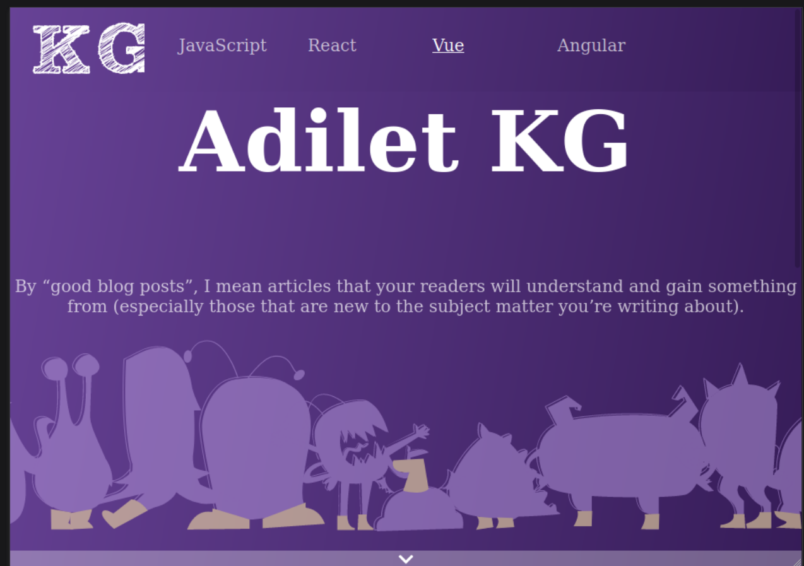

# _RemovingHeaderWhenScrollingJS_

#### _Version 1_
#### _Date 10/20/2020_
#### By _**Adilet Momunaliev**_

## Description

_Header slides up(by animation) when app opened.In addition, nav slides down when one of links is clicked ._

## Getting Started

These instructions will get you a copy of the project up and running on your local machine for development and testing purposes.

### Instruction

* Node js in your local machine
* git clone https://github.com/Adilet312/RemovingHeaderCueWhenScrolling.git
* npm install
* npm run start
### Specifications
 ;
## Technologies Used

_HTML, CSS, JavaScript, DOM Elements and Methods, IDE Atom_

### License

*_Copyright (c) 2020 **Adilet Momunaliev**_*
